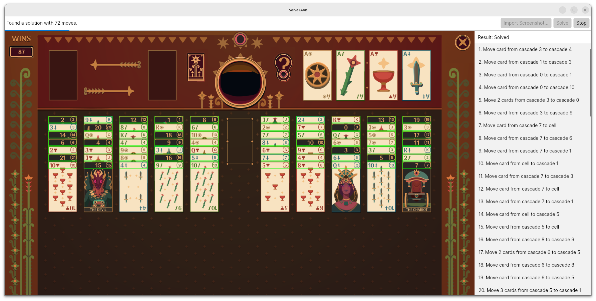

# FfSolver

This is a solver for the solitaire-based card game Fortune’s Foundation, which is part of the [Zachtronics Solitaire Collection](https://www.zachtronics.com/solitaire-collection/) made by [Zachtronics](https://www.zachtronics.com/).

It can solve start and mid-game board states and also features detecting board states from screenshots. The solver can be either run as UI application and or as a console application.

## How To Build

.NET 8 is required. Go to the top-level directory and build with `dotnet build`.

## Run as UI Application

Start the application with `dotnet run --project src/SolverAvn/SolverAvn.csproj`. 

1. Afterwards, you can load a screenshot by clicking *Import Screenshot*. The image must be a screenshot of the game's board with the game resolution set to 1920x1080 ([example file](src/SolverApp/image.png)).

1. If board detection was successful, you should see the detected cards highlighted in the displayed screenshot image.

1. Click on *Solve* to start the solver. The solver will try to find a solution within 100,000 iterations. After finding an initial solution, it will look for solutions with fewer moves. Click on *Stop* to abort solving and use the latest solution found.

## Run as Console Application

<pre>
5♠   J♣   3♦   9♦   8     --  10♥  Q♠   4♣   5♣   0   
7♣   2♥   K♥   7♠   10♠   --  J♠   10♦  20   21   1   
4♥   5    6♦   Q♣   10♣   --  K♠   8♥   2♠   8♠   8♣  
7♥   K♦   6♣   11   J♥    --  K♣   16   5♥   3♠   10  
9    7♦   5♦   3♣   J♦    --  7    13   4♦   2♦   2   
6♥   14   3    2♣   Q♦    --  9♥   9♣   4♠   6♠   19  
15   9♠   17   3♥   18    --  4    12   6    Q♥   8♦  
</pre>

Run the solver with the board state read from an image using the command
`dotnet run --project src/SolverApp/SolverApp.csproj -- -i src/SolverApp/image.png`.
The image must be a screenshot of the game's board with the game resolution set to 1920x1080 ([example file](src/SolverApp/image.png)).

You can also run the solver with the board state read from a text file using the command
`dotnet run --project src/SolverApp/SolverApp.csproj -- -i src/SolverApp/example.txt -t` ([example file](src/SolverApp/example.txt)).

If a solution is found, all moves will be printed out with a pretty-print of the board state after each move. Moves automatically performed by the game are omitted.

The solver uses [A*](https://en.wikipedia.org/wiki/A*_search_algorithm) as pathfinding strategy and will typically produce solutions with 60 to 70 moves. There's a unit test for playing around with the solver located in [src/Solver.Tests/SolverTests.cs](src/Solver.Tests/SolverTests.cs).
There are additional options to customize the search for solutions. See the full list of arguments:

| Short | Long       | Description                                   | Default |
|-------|------------|-----------------------------------------------|---------|
| -i    | --input    | Required. Path to input file                  | -       |
| -t    | --text     | Read text instead of image from input file    | false   |
| -m    | --max-iter | Maximum number of iterations                  | 100000  |
| -s    | --steps    | Maximum number of moves a solution may have   | 80      |
| -f    | --full     | Evaluate all iterations to find best solution | false   |
